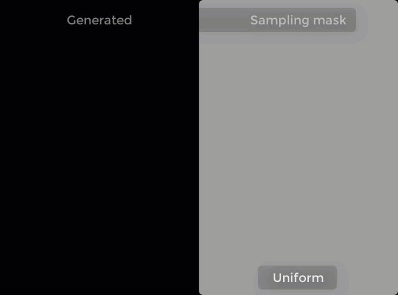

# Genetic Drawing

Examples of generated images:

 

It also supports user-created sampling masks, in case you'd like to specify regions where more brushstrokes are needed (for ex, to allocate more finer details)

## Python
you would need the following python 3 libraries:

* opencv 3.4.1
* numpy 1.16.2
* matplotlib 3.0.3
* and Jupyter Notebook

To start, open the GeneticDrawing.ipynb and run the example code
